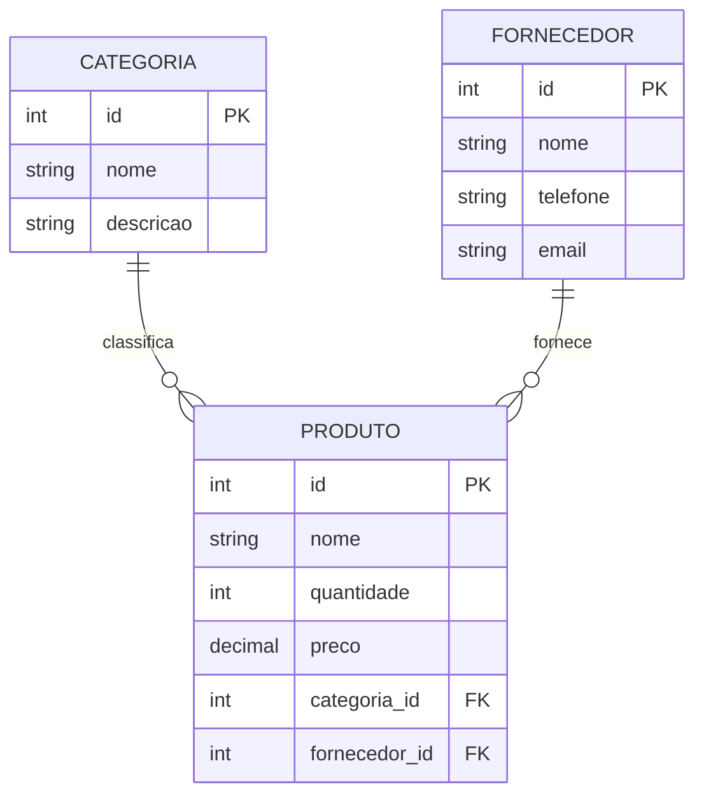

# Diagrama Entidade-Relacionamento

```mermaid
erDiagram
    CATEGORIA ||--o{ PRODUTO : classifica
    FORNECEDOR ||--o{ PRODUTO : fornece

    CATEGORIA {
        int id PK
        string nome
        string descricao
    }
    FORNECEDOR {
        int id PK
        string nome
        string telefone
        string email
    }
    PRODUTO {
        int id PK
        string nome
        int quantidade
        decimal preco
        int categoria_id FK
        int fornecedor_id FK
    }
```

Um produto pertence a uma categoria e é associado a um fornecedor. Uma categoria ou fornecedor pode estar relacionado a vários produtos.

